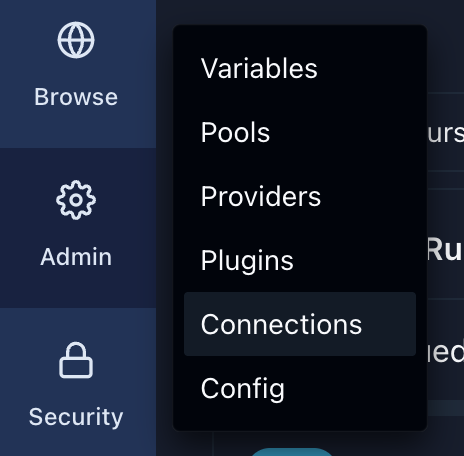
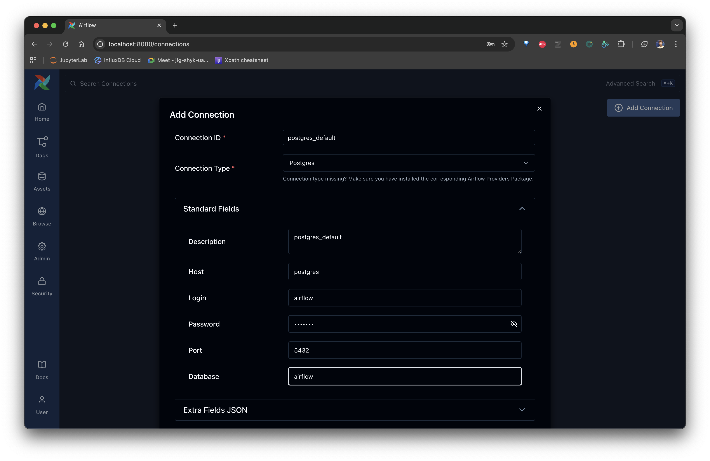

## Table of contents

* What is Airflow?
* What's the point of Airflow?
* What can and can't it do?
* The Dag
* The Operators
* Trigger Rules

## Requirements

* To have docker *and* docker-compose installed.
* Install docker and docker-compose exactly as it is described in the website.
* **do not do do apt install docker or docker-compose**

## How to spin the webserver up

### Prepping

First, get your **id**:
```sh
id -u
```

Now edit the **.env** file and swap out 501 for your own.

Run the following command to creat the volumes needed in order to send data to airflow:

```sh
mkdir -p ./dags ./logs ./plugins
```

create JWT secret, using this [website](https://jwtsecrets.com/)
or look [here](https://www.willhaley.com/blog/generate-jwt-with-bash/).

And run this **once**:
```sh
docker-compose up airflow-init
```

If the exit code is 0 then it's all good.

### Running

```sh
docker-compose up -d
```

### After it is up, add a new connection

* Name - postgres_default
* Conn type - postgres
* Host - localhost
* Port - 5432
* Database - airflow
* Username - airflow
* Password - airflow





## Practice

## `first_dag` — tutorial

A gentle, end-to-end walkthrough of modern Airflow 3.x patterns. It defines a DAG with a fixed `start_date`, `catchup=False`, and a linear chain that (1) fetches a file, (2) converts it, (3) filters it, (4) “loads” it, and (5) cleans up. It highlights current imports (from `airflow.providers.standard` where applicable), Jinja templating (e.g., `{{ ds_nodash }}` / `{{ data_interval_* }}`), retries, and trigger rules.

**Steps**

1. **Prereqs:** Airflow ≥ 3.x. Work in `first_dag_stub.py` into your `dags/` folder.
2. **Imports:** for the stubbed version, use only `EmptyOperator` from `airflow.providers.standard.operators.empty`.

3. **Paths:** examples use `/opt/airflow/data` (recommended). Adjust if your image uses another path.
4. **Enable:** Airflow UI → *DAGs* → toggle **first_dag** on.
5. **Trigger:** from UI
   
6. **Observe:** in Graph view you should see the chain
   `get_spreadsheet → transmute_to_csv → time_filter → load → cleanup`.

7. **Logs:** in ```logs``` folder, divided by tasks.

---

## `second_dag` — exercise (builds on the tutorial)

An applied exercise that mirrors the tutorial’s structure but with richer control flow and database I/O. It demonstrates Python callables, branching, file artifacts, and executing SQL via the **Common SQL** operator against Postgres.

**What it covers**

* Modern DAG config (fixed `start_date`, `catchup=False`, `max_active_tasks`)
* `PythonOperator`/`BranchPythonOperator` for branching
* Jinja macros based on the data interval
  
* Database writes using:

  ```python
  from airflow.providers.common.sql.operators.sql import SQLExecuteQueryOperator
  ```

  with `conn_id="postgres_default"` (do not forget to add Postgres connection)

**Steps**

1. **Prereqs:** Airflow ≥ 3.x

2. **Place the DAG:** use `second_dag_stub.py` into `dags/`.
3. **Configure connection:** in the Airflow UI, create **Connection** `postgres_default` (Conn Type: *Postgres*).
4. **Enable & trigger from UI
5. **Follow the flow:** it branches after an “emptiness/spell” check; both transformation branches converge before running SQL.
6. **Troubleshooting:**

   * Import paths should use **providers.standard** for core operators in Airflow 3.x.
   * If SQL can’t find files, pass SQL text via XCom (as in the advanced example below) or ensure the file is in `template_searchpath`.

---

## `assignment_dag` — extended exercise (API + logging + DB)

This DAG turns the concepts into a realistic pipeline: it calls a public API (D&D 5e), generates synthetic data, branches on runtime conditions, merges intermediate JSONs, and executes SQL against Postgres using `SQLExecuteQueryOperator`. It includes structured logging and a failure callback for clear console diagnostics.

**Highlights**

* Modern imports:

  ```python
  from airflow.providers.standard.operators.python import PythonOperator, BranchPythonOperator
  from airflow.providers.standard.operators.empty import EmptyOperator
  from airflow.providers.common.sql.operators.sql import SQLExecuteQueryOperator
  ```
* Structured logging with `logging.getLogger(__name__)`
* Robust API calls with timeouts
* Avoids “template file not found” by generating SQL in a Python task and passing it via XCom:

  ```python
  tenth_node = SQLExecuteQueryOperator(
      task_id="insert_inserts",
      conn_id="postgres_not_default",
      sql="{{ ti.xcom_pull(task_ids='generate_sql') }}",
      autocommit=True,
  )
  ```

**Steps**

1. **Prereqs:**

   * Airflow ≥ 3.x
   * Providers: `apache-airflow-providers-common-sql`, `apache-airflow-providers-postgres`
   * Outbound network allowed to `https://www.dnd5eapi.co/api`
   * Airflow connection (create new database)`postgres_not_default` pointing to your DB
2. **Paths:** default artifact dir is `/opt/airflow/data`. Create it and ensure write perms.
3. **Place the DAG:** create file `assignment_dag.py` in `dags/`.
4. **Enable & trigger**: UI
5. **Execution order (happy path):**
   `name_race → attributes → language → class → proficiency_choices → levels → spell_check → (spells?) → merge → generate_sql → insert_inserts → finale`
6. **Logging tips:**

   * Operator logs show `INFO`/`DEBUG` breadcrumbs and full tracebacks on failure.
   * To increase verbosity globally:

     ```bash
     # docker-compose env
     AIRFLOW__LOGGING__LOGGING_LEVEL=DEBUG
     ```

     or set `[logging] logging_level = DEBUG` in `airflow.cfg`.
