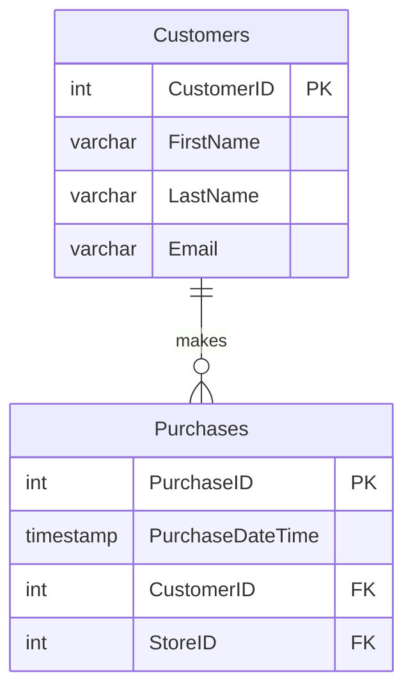
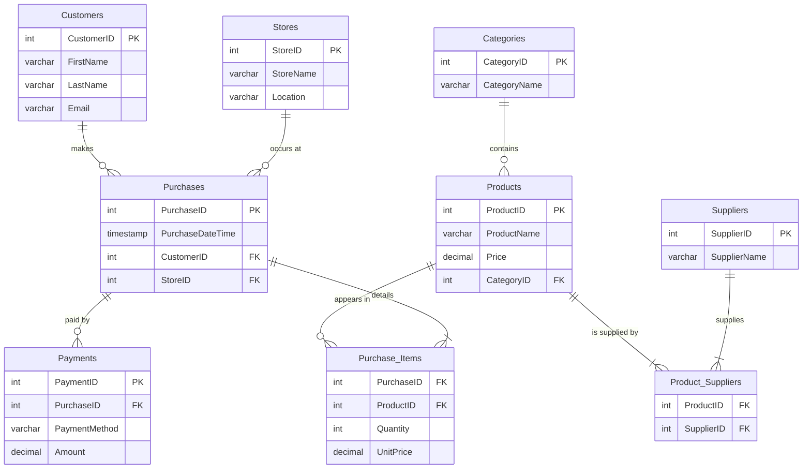
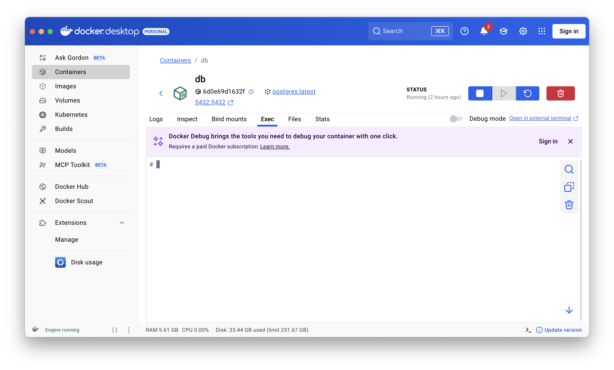
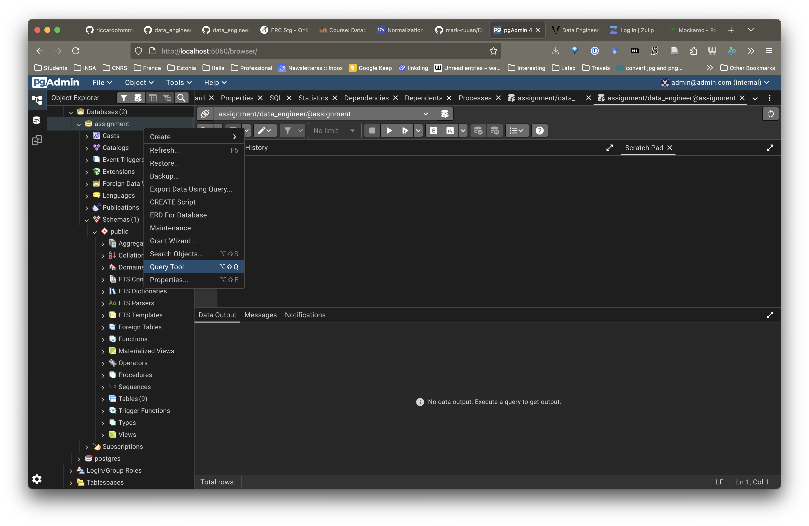

# Practice 3: Supermarket Database - ER Diagram Design (Courtesy of  Hasan Tanvir, Kristo Raun, and Ahmed Wael )

Welcome to the second practice session! The goal of this exercise is to design and implement a normalized relational database for a supermarket's operational needs. We will analyze the business requirements, design an Entity-Relationship (ER) Diagram, and then build the database schema in PostgreSQL.

## Table of Contents

- [Practice 3: Supermarket Database - ER Diagram Design](#practice-3-supermarket-database---er-diagram-design)
  - [Table of Contents](#table-of-contents)
  - [Case Scenario: Supermarket Sales](#case-scenario-supermarket-sales)
    - [Operational Needs](#operational-needs)
  - [What is an ER Diagram?](#what-is-an-er-diagram)
  - [The Core Components (The Shapes and Symbols)](#the-core-components-the-shapes-and-symbols)
    - [1. Entities](#1-entities)
    - [2. Attributes](#2-attributes)
      - [Special Attributes: Keys](#special-attributes-keys)
    - [3. Relationships](#3-relationships)
    - [Understanding Cardinality (The Lines and Crow's Feet)](#understanding-cardinality-the-lines-and-crows-feet)
      - [How to Read It: An Example](#how-to-read-it-an-example)
  - [Environment Setup](#environment-setup)
  - [2. Practice Tasks](#2-practice-tasks)
    - [Task 1: Group Discussion (15 mins)](#task-1-group-discussion-15-mins)
    - [Task 2 (Together): Design the ER Diagram (25 mins)](#task-2-together-design-the-er-diagram-25-mins)
    - [Solution](#solution)
    - [Task 3: Implement the ER Diagram in Postgres (30 mins)](#task-3-implement-the-er-diagram-in-postgres-30-mins)
      - [First Method](#first-method)
      - [Second Method](#second-method)
      - [Third Method (reccomended)](#third-method-reccomended)
    - [Task 5: Query Answering (30 mins)](#task-5-query-answering-30-mins)
    - [Task 6: Update the Database  (30 mins)](#task-6-update-the-database--30-mins)
    - [Wrap-up \& Discussion (15 mins)](#wrap-up--discussion-15-mins)

## Case Scenario: Supermarket Sales

You are a data engineer tasked with designing the core operational database for a medium-sized supermarket chain with 10 stores.

### Operational Needs

The system must handle the day-to-day transactions and data management. The key requirements are:
- Each customer can make many purchases.
- A purchase happens at a specific store, has a date/time, and contains one or more products.
- Each product belongs to a category and can be supplied by one or more suppliers.
- Payments can be made by cash, card, or voucher

---

## What is an ER Diagram?

An ER Diagram (or ERD) is a visual flowchart that illustrates how different "things" or **entities** relate to each other within a system. It's the primary way we model the structure of a relational database.

Its main purposes are:
- **To visualize data:** It gives a clear, high-level view of what we're storing.
- **To plan the database:** It helps us design the tables and their connections before writing any code.
- **To communicate:** It allows data engineers, developers, and business stakeholders to agree on what the system needs to do.

An ERD has three core components: **Entities**, **Attributes**, and **Relationships**.

## The Core Components (The Shapes and Symbols)

### 1. Entities

An entity is a real-world object or concept that we want to store data about. Think of them as the "nouns" of our system. In our diagrams, an entity is represented by a **rectangle**.

**Examples from our Supermarket case:**
- `Customer`
- `Product`
- `Store`
- `Purchase`

```
+-----------+
|  Customer |
+-----------+
```

### 2. Attributes

An attribute is a property or characteristic of an entity. Think of them as the "adjectives" or "details" that describe a noun. In modern diagrams (like the ones we'll use), attributes are listed inside the entity's rectangle.

**Examples:**
- For the `Customer` entity, attributes could be `FirstName`, `LastName`, and `Email`.
- For the `Product` entity, attributes could be `ProductName` and `Price`.

```
+-------------------+
|     Customer      |
+-------------------+
| CustomerID (PK)   |
| FirstName         |
| LastName          |
| Email             |
+-------------------+
```

#### Special Attributes: Keys

- **Primary Key (PK):** This is a special attribute that **uniquely identifies** each record in a table. A `CustomerID` of 12 should only ever refer to one specific person. No two customers can have the same `CustomerID`. A primary key cannot be empty.
- **Foreign Key (FK):** This is an attribute in one table that is a primary key in another table. It's the "glue" that **creates a link or relationship** between two tables. For example, to know which customer made a purchase, the `Purchases` table will have a `CustomerID` attribute, which links back to the `Customers` table.

### 3. Relationships

A relationship describes how two or more entities are associated with each other. Think of them as the "verbs" that connect the nouns. In our diagrams, a relationship is represented by a **line** connecting two entities.

**Example:**
- A `Customer` *makes* a `Purchase`. This creates a relationship between the `Customer` and `Purchase` entities.

### Understanding Cardinality (The Lines and Crow's Feet)

This is the most important part of a relationship. Cardinality defines the **rules** of the association. It answers the question: "How many instances of Entity A can be associated with how many instances of Entity B?"

We use a notation called **Crow's Foot Notation** on the ends of our relationship lines.

Here are the symbols you need to know:

[ref](https://help.lucid.co/hc/en-us/articles/16471565238292-Create-an-Entity-Relationship-Diagram-in-Lucidchart)

#### How to Read It: An Example

Let's look at the relationship between `Customers` and `Purchases`

To understand this, you read the symbol **closest to the other table**:

1. **From Customer's Perspective:**
    - Start at `Customers` and look at the symbol next to `Purchases`. It's  Zero or Many.
    - This means: "One `Customer` can be associated with **zero or many** `Purchases`." (This makes sense; a new customer might have zero purchases yet).

2. **From Purchase's Perspective:**
    - Start at `Purchases` and look at the symbol next to `Customers`. It's One and Only One.
    - This means: "One `Purchase` must be associated with **one and only one** `Customer`." (This makes sense; a single receipt belongs to a single customer).



---

## Environment Setup

We will use Docker to create a consistent and isolated environment containing a PostgreSQL database and a pgAdmin interface.

You can use the same containers from last practice session. In case you don't, please follow the steps below.

1. **Create the necessary files and folders.** Your project structure should look like this:

    ```
    .
    ├── compose.yml
    ├── .env
    └── pgtmp/
        ├── create_table.sql
    ```

2. **`docker-compose.yml`**: Copy the following content into this file. This defines our three services: `db` and `pgadmin`.

    ```yaml
    services:
      db:
        container_name: db
        image: postgres
        environment:
          POSTGRES_USER: ${POSTGRES_USER}
          POSTGRES_PASSWORD: ${POSTGRES_PASSWORD}
          POSTGRES_DB: ${POSTGRES_DB}
        PGUSER: ${POSTGRES_USER} # for the psql client
        PGPASSWORD: ${POSTGRES_PASSWORD} # for the psql client
        PGDATABASE: ${POSTGRES_DB} # for the psql client
        ports:
          - "5432:5432"
        volumes:
          - ./pgdata:/var/lib/postgresql/data
          - ./pgtmp:/tmp

      pgadmin:
        container_name: pgadmin
        image: elestio/pgadmin
        environment:
          PGADMIN_DEFAULT_EMAIL: ${PGADMIN_DEFAULT_EMAIL}
          PGADMIN_DEFAULT_PASSWORD: ${PGADMIN_DEFAULT_PASSWORD}
        ports:
          - "5050:80"
        depends_on:
          - db
    ```

3. **`.env`**: This file stores our secrets. Create it in the same directory and add the following content:

    ```env
    POSTGRES_USER=data_engineer
    POSTGRES_PASSWORD=Pass!w0rd
    POSTGRES_DB=assignment
    PGADMIN_DEFAULT_EMAIL=admin@admin.com
    PGADMIN_DEFAULT_PASSWORD=root
    ```

5. **Start the Services**: Open a terminal in the project's root directory and run:

    ```bash
    docker-compose up -d
    ```

    This will download the images and start all three containers in the background. It might take a few minutes the first time.

6. **Connect with pgAdmin**:
    - Open your web browser and go to `http://localhost:5050`.
    - Log in using the email (`admin@admin.com`) and password (`root`) from your `.env` file.
    - To connect to your database:
        1. Right-click `Servers` -> `Create` -> `Server...`.
        2. **General tab**: Give it a name (e.g., "Supermarket DB").
        3. **Connection tab**:
            - **Host name/address**: `db` (This is the service name from `compose.yml`).
            - **Port**: `5432`.
            - **Maintenance database**: `assignment`.
            - **Username**: `data_engineer`.
            - **Password**: `Pass!w0rd`.
        4. Click `Save`. You should now be connected to your PostgreSQL database!

---

## 2. Practice Tasks

### Task 1: Group Discussion (15 mins)

Discuss the **Operational Needs** with your group.
- What are the main "things" or **entities** we need to track? (e.g., Customer, Product...).
- How do they relate to each other? (e.g., A customer *makes* a purchase).
- What is a **Many-to-Many** relationship? Can you spot any in the requirements? How might we solve them?
- Why is a normalized database important for an operational system like this?

### Task 2 (Together): Design the ER Diagram (25 mins)

Using a tool like [draw.io](https://draw.io), Lucidchart, or by writing Mermaid code, design an ER Diagram that meets all the operational requirements.
- Focus on creating distinct tables for each entity.
- Use **junction tables** (also called linking or bridge tables) to resolve any many-to-many relationships.
- Define the primary keys (PK) and foreign keys (FK) for each table.


### Solution
<details>
<summary>Click here to see the solution for the ER Diagram (Mermaid Code)</summary>



</details>

### Task 3: Implement the ER Diagram in Postgres (30 mins)

Now, translate your diagram into a database schema. You need to create a file ```create_table.sql``` with the create table statements. Be rigorious with Table names, attributes names and types, because you will have to load the data!

```sql
CREATE TABLE Products (
    ProductID SERIAL PRIMARY KEY,
    ProductName VARCHAR(255) NOT NULL,
    Price DECIMAL(10, 2) NOT NULL,
    CategoryID INT,
    CONSTRAINT fk_category
        FOREIGN KEY(CategoryID)
        REFERENCES Categories(CategoryID)
);
```

Once you have the file,there are three ways to load it:

#### First Method

Following previous practice session, Create the table:
`docker exec -it db bash -c "psql -f /tmp/create_table.sql"` 

#### Second Method

Use psql from docker desktop, 'exec' tab.


#### Third Method (reccomended)

1. In **pgAdmin**, at [localhost:5050](https://localhost:5050) select your database (`assignment`), and open the **Query Tool**.

2. Copy the complete SQL script below, paste it into the Query Tool, and execute it. This script will create all the necessary tables and relationships.



### Task 5: Query Answering (30 mins)

Load the data in ```data.sql``` (same as before), and execute the following queries in SQL.

1. Unpaid purchases (no payment recorded)

```sql
SELECT p.PurchaseID, p.PurchaseDateTime, c.FirstName, c.LastName, s.StoreName
FROM Purchases p
JOIN Customers c ON c.CustomerID = p.CustomerID
JOIN Stores s ON s.StoreID = p.StoreID
LEFT JOIN Payments pay ON pay.PurchaseID = p.PurchaseID
WHERE pay.PurchaseID IS NULL
ORDER BY p.PurchaseDateTime DESC;
```

2. Customer’s last 5 purchases with item count and paid amount
3. Revenue & transaction count per store in a date range
4. Top 5 products by revenue in the last N days
5. Suppliers for a given product (comma-separated)
6. Monthly revenue by category and by store's location
   a. can you add the year-over-year growth
7. Monthly customer retention (“customers who bought in month N AND month N−1”.)

### Task 6: Update the Database  (30 mins)

Execute the following updates and test them according to the query above

1. Update a customer’s email (safely avoid unique-email conflicts)

```sql
UPDATE Customers
SET Email = $2
WHERE CustomerID = $1
  AND NOT EXISTS (SELECT 1 FROM Customers WHERE Email = $2)
RETURNING CustomerID, FirstName, LastName, Email;
-- $1 = customer_id, $2 = new_email
```

2. Move a purchase to a different store
3. Change payment method and amount for a purchase (idempotent on PurchaseID)
4. Reassign a product to a category (create category if it doesn’t exist)
5. Optimistic price change (only if current price matches expected old price)

### Wrap-up & Discussion (15 mins)

Congratulations, you have built a normalized operational database! Let's discuss:

- How many tables did you end up with? Why so many?
- Imagine you are a manager who wants a report of the "Top 5 best-selling products this month". How many tables would you need to `JOIN` to get this information?
- Is this database design good for generating business reports (analytics) or is it better for day-to-day transactions (operations)? Why?
