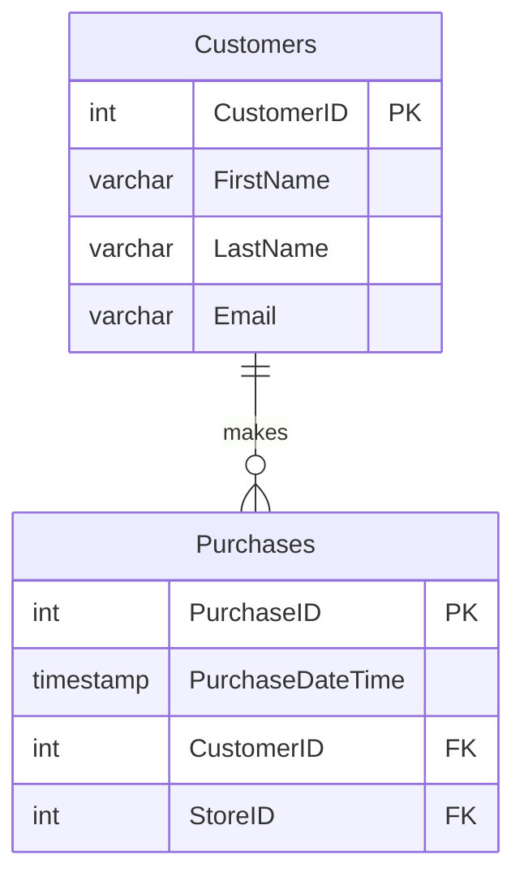
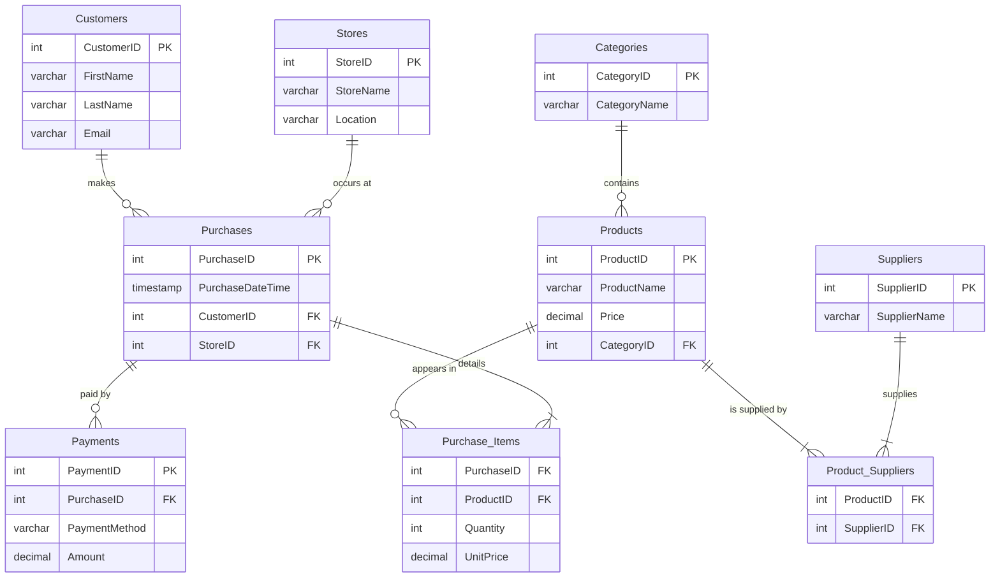

# Practice 2: Supermarket Database - ER Diagram Design

Welcome to the second practice session! The goal of this exercise is to design and implement a normalized relational database for a supermarket's operational needs. We will analyze the business requirements, design an Entity-Relationship (ER) Diagram, and then build the database schema in PostgreSQL.


## Table of Contents

- [Case Scenario: Supermarket Sales](#case-scenario-supermarket-sales)
- [What is an ER Diagram?](#what-is-an-er-diagram)
  - [1. Entities](#1-entities)
  - [2. Attributes](#2-attributes)
  - [3. Relationships & Cardinality (The Lines and Crow's Feet)](#3-relationships--cardinality-the-lines-and-crows-feet)
- [Environment Setup](#environment-setup)
- [2. Practice Tasks](#2-practice-tasks)
  - [Task 1: Group Discussion (15 mins)](#task-1-group-discussion-15-mins)
  - [Task 2: Design the ER Diagram (25 mins)](#task-2-design-the-er-diagram-25-mins)
  - [Task 3: Implement the ER Diagram in Postgres (30 mins)](#task-3-implement-the-er-diagram-in-postgres-30-mins)
  - [Task 4: Wrap-up & Discussion (15 mins)](#task-4-wrap-up--discussion-15-mins)
## Case Scenario: Supermarket Sales

You are a data engineer tasked with designing the core operational database for a medium-sized supermarket chain with 10 stores.

### Operational Needs

The system must handle the day-to-day transactions and data management. The key requirements are:
*   Each customer can make many purchases.
*   A purchase happens at a specific store, has a date/time, and contains one or more products.
*   Each product belongs to a category and can be supplied by one or more suppliers.
*   Payments can be made by cash, card, or voucher
---

## What is an ER Diagram?

An ER Diagram (or ERD) is a visual flowchart that illustrates how different "things" or **entities** relate to each other within a system. It's the primary way we model the structure of a relational database.

Its main purposes are:
*   **To visualize data:** It gives a clear, high-level view of what we're storing.
*   **To plan the database:** It helps us design the tables and their connections before writing any code.
*   **To communicate:** It allows data engineers, developers, and business stakeholders to agree on what the system needs to do.

An ERD has three core components: **Entities**, **Attributes**, and **Relationships**.

## The Core Components (The Shapes and Symbols)

### 1. Entities

An entity is a real-world object or concept that we want to store data about. Think of them as the "nouns" of our system. In our diagrams, an entity is represented by a **rectangle**.

**Examples from our Supermarket case:**
*   `Customer`
*   `Product`
*   `Store`
*   `Purchase`

```
+-----------+
|  Customer |
+-----------+
```

### 2. Attributes

An attribute is a property or characteristic of an entity. Think of them as the "adjectives" or "details" that describe a noun. In modern diagrams (like the ones we'll use), attributes are listed inside the entity's rectangle.

**Examples:**
*   For the `Customer` entity, attributes could be `FirstName`, `LastName`, and `Email`.
*   For the `Product` entity, attributes could be `ProductName` and `Price`.

```
+-------------------+
|     Customer      |
+-------------------+
| CustomerID (PK)   |
| FirstName         |
| LastName          |
| Email             |
+-------------------+
```

#### Special Attributes: Keys

*   **Primary Key (PK):** This is a special attribute that **uniquely identifies** each record in a table. A `CustomerID` of 12 should only ever refer to one specific person. No two customers can have the same `CustomerID`. A primary key cannot be empty.
*   **Foreign Key (FK):** This is an attribute in one table that is a primary key in another table. It's the "glue" that **creates a link or relationship** between two tables. For example, to know which customer made a purchase, the `Purchases` table will have a `CustomerID` attribute, which links back to the `Customers` table.

### 3. Relationships

A relationship describes how two or more entities are associated with each other. Think of them as the "verbs" that connect the nouns. In our diagrams, a relationship is represented by a **line** connecting two entities.

**Example:**
*   A `Customer` *makes* a `Purchase`. This creates a relationship between the `Customer` and `Purchase` entities.

### Understanding Cardinality (The Lines and Crow's Feet)

This is the most important part of a relationship. Cardinality defines the **rules** of the association. It answers the question: "How many instances of Entity A can be associated with how many instances of Entity B?"

We use a notation called **Crow's Foot Notation** on the ends of our relationship lines.

Here are the symbols you need to know:

[ref](https://help.lucid.co/hc/en-us/articles/16471565238292-Create-an-Entity-Relationship-Diagram-in-Lucidchart)
#### How to Read It: An Example

Let's look at the relationship between `Customers` and `Purchases`


To understand this, you read the symbol **closest to the other table**:

1.  **From Customer's Perspective:**
    *   Start at `Customers` and look at the symbol next to `Purchases`. It's  Zero or Many.
    *   This means: "One `Customer` can be associated with **zero or many** `Purchases`." (This makes sense; a new customer might have zero purchases yet).

2.  **From Purchase's Perspective:**
    *   Start at `Purchases` and look at the symbol next to `Customers`. It's One and Only One.
    *   This means: "One `Purchase` must be associated with **one and only one** `Customer`." (This makes sense; a single receipt belongs to a single customer).

---

## Environment Setup

We will use Docker to create a consistent and isolated environment containing a PostgreSQL database and a pgAdmin interface.

You can use the same containers from last practice session. In case you don't, please follow the steps below.


1.  **Create the necessary files and folders.** Your project structure should look like this:

    ```
    .
    ├── compose.yml
    ├── .env
    └── pgtmp/
        ├── create_table.sql
    ```

2.  **`compose.yml`**: Copy the following content into this file. This defines our three services: `db` and `pgadmin`.

    ```yaml
    services:
      db:
        container_name: db
        image: postgres:16.4
        environment:
          POSTGRES_USER: ${POSTGRES_USER}
          POSTGRES_PASSWORD: ${POSTGRES_PASSWORD}
          POSTGRES_DB: ${POSTGRES_DB}
        PGUSER: ${POSTGRES_USER} # for the psql client
        PGPASSWORD: ${POSTGRES_PASSWORD} # for the psql client
        PGDATABASE: ${POSTGRES_DB} # for the psql client
        ports:
          - "5432:5432"
        volumes:
          - ./pgdata:/var/lib/postgresql/data
          - ./pgtmp:/tmp

      pgadmin:
        container_name: pgadmin
        image: elestio/pgadmin:REL-8_10
        environment:
          PGADMIN_DEFAULT_EMAIL: ${PGADMIN_DEFAULT_EMAIL}
          PGADMIN_DEFAULT_PASSWORD: ${PGADMIN_DEFAULT_PASSWORD}
        ports:
          - "5050:80"
        depends_on:
          - db
    ```

3.  **`.env`**: This file stores our secrets. Create it in the same directory and add the following content:

    ```env
    POSTGRES_USER=data_engineer
    POSTGRES_PASSWORD=Pass!w0rd
    POSTGRES_DB=assignment
    PGADMIN_DEFAULT_EMAIL=admin@admin.com
    PGADMIN_DEFAULT_PASSWORD=root
    ```


5.  **Start the Services**: Open a terminal in the project's root directory and run:

    ```bash
    docker-compose up -d
    ```

    This will download the images and start all three containers in the background. It might take a few minutes the first time.

6.  **Connect with pgAdmin**:
    *   Open your web browser and go to `http://localhost:5050`.
    *   Log in using the email (`admin@admin.com`) and password (`root`) from your `.env` file.
    *   To connect to your database:
        1.  Right-click `Servers` -> `Create` -> `Server...`.
        2.  **General tab**: Give it a name (e.g., "Supermarket DB").
        3.  **Connection tab**:
            *   **Host name/address**: `db` (This is the service name from `compose.yml`).
            *   **Port**: `5432`.
            *   **Maintenance database**: `assignment`.
            *   **Username**: `data_engineer`.
            *   **Password**: `Pass!w0rd`.
        4.  Click `Save`. You should now be connected to your PostgreSQL database!

---

## 2. Practice Tasks

### Task 1: Group Discussion (15 mins)

Discuss the **Operational Needs** with your group.
*   What are the main "things" or **entities** we need to track? (e.g., Customer, Product...).
*   How do they relate to each other? (e.g., A customer *makes* a purchase).
*   What is a **Many-to-Many** relationship? Can you spot any in the requirements? How might we solve them?
*   Why is a normalized database important for an operational system like this?
### Solution:
<details>
<summary>Click here to see the Solution</summary>

#### Q: What are the main "things" or entities we need to track?
The main entities are the core "nouns" of the business requirements:
*   **Customers**: The people who buy things.
*   **Purchases** (or Sales/Transactions): The event of a customer buying products.
*   **Stores**: The physical locations where purchases happen.
*   **Products**: The items for sale.
*   **Categories**: The groupings for products (e.g., 'Dairy', 'Bakery').
*   **Suppliers**: The companies that provide the products.
*   **Payments**: The method and record of payment for a purchase.

#### Q: How do they relate to each other?
*   A **Customer** makes many **Purchases** (One-to-Many).
*   A **Store** is the location for many **Purchases** (One-to-Many).
*   A **Category** contains many **Products** (One-to-Many).
*   A **Purchase** has one **Payment** (One-to-One).

#### Q: What is a Many-to-Many relationship? Can you spot any? How do we solve them?
A Many-to-Many (M:N) relationship is where one record in Table A can be linked to many records in Table B, AND one record in Table B can be linked to many records in Table A.

There are two critical M:N relationships in our requirements:
1.  **Purchases and Products:** A single **Purchase** can contain many **Products**. A single **Product** (like milk) can be a part of many different **Purchases** over time.
2.  **Products and Suppliers:** A **Product** can be supplied by many **Suppliers**. A **Supplier** can provide many different **Products**.

**Solution:** We cannot connect these tables directly. The solution is to create a **Junction Table** (or linking table) in between them.
*   For Purchases and Products, we create **`Purchase_Items`**. Each row in this table links one specific purchase to one specific product and stores the quantity.
*   For Products and Suppliers, we create **`Product_Suppliers`**. Each row links one product to one of its suppliers.

#### Q: Why is a normalized database important for an operational system like this?
Normalization is crucial for an **OLTP (Online Transaction Processing)** system for three main reasons:
1.  **Eliminates Data Redundancy:** Each piece of information is stored only once. For example, a supplier's name is stored in one place. If we need to update it, we only change it in that one place.
2.  **Prevents Data Anomalies:** This prevents errors during data modification. For example, if we didn't normalize and stored the product price on every single sales receipt line, changing the price of milk would require updating thousands of historical records, which is impossible. With normalization, we just update the single price in the `Products` table.
3.  **Ensures Data Integrity:** The use of primary and foreign keys ensures that relationships are valid. You can't record a sale for a product that doesn't exist or a purchase from a customer who isn't in the database. This makes the data trustworthy.
</details>

### Task 2: Design the ER Diagram (25 mins)

Using a tool like [draw.io](https://draw.io), Lucidchart, or by writing Mermaid code, design an ER Diagram that meets all the operational requirements.
*   Focus on creating distinct tables for each entity.
*   Use **junction tables** (also called linking or bridge tables) to resolve any many-to-many relationships.
*   Define the primary keys (PK) and foreign keys (FK) for each table.

### Solution
<details>
<summary>Click here to see the solution for the ER Diagram (Mermaid Code)</summary>



</details>

### Task 3: Implement the ER Diagram in Postgres (30 mins)

Now, translate your diagram into a database schema.
There are two ways to do so,
#### First Method:
Following previous practice session, Create the table: 
`docker exec -it db bash -c "psql -f /tmp/create_table.sql"`

#### Second Method:
1.  In **pgAdmin**, select your database (`assignment`), and open the **Query Tool**.
2.  Copy the complete SQL script below, paste it into the Query Tool, and execute it. This script will create all the necessary tables and relationships.

### Solution:
<details>
<summary>Click here for the Solution</summary>

```sql
-- This script creates a normalized database structure for the supermarket.

-- Table for Product Categories
CREATE TABLE Categories (
    CategoryID SERIAL PRIMARY KEY,
    CategoryName VARCHAR(255) NOT NULL UNIQUE
);

-- Table for Suppliers
CREATE TABLE Suppliers (
    SupplierID SERIAL PRIMARY KEY,
    SupplierName VARCHAR(255) NOT NULL
);

-- Table for Products
CREATE TABLE Products (
    ProductID SERIAL PRIMARY KEY,
    ProductName VARCHAR(255) NOT NULL,
    Price DECIMAL(10, 2) NOT NULL,
    CategoryID INT,
    CONSTRAINT fk_category
        FOREIGN KEY(CategoryID)
        REFERENCES Categories(CategoryID)
);

-- JUNCTION TABLE: Product_Suppliers
-- Resolves the many-to-many relationship between Products and Suppliers.
CREATE TABLE Product_Suppliers (
    ProductID INT,
    SupplierID INT,
    PRIMARY KEY (ProductID, SupplierID),
    CONSTRAINT fk_product
        FOREIGN KEY(ProductID)
        REFERENCES Products(ProductID),
    CONSTRAINT fk_supplier
        FOREIGN KEY(SupplierID)
        REFERENCES Suppliers(SupplierID)
);

-- Table for Stores
CREATE TABLE Stores (
    StoreID SERIAL PRIMARY KEY,
    StoreName VARCHAR(255) NOT NULL,
    Location VARCHAR(255)
);

-- Table for Customers
CREATE TABLE Customers (
    CustomerID SERIAL PRIMARY KEY,
    FirstName VARCHAR(255) NOT NULL,
    LastName VARCHAR(255),
    Email VARCHAR(255) UNIQUE
);

-- Table for Purchases (Transactions)
CREATE TABLE Purchases (
    PurchaseID SERIAL PRIMARY KEY,
    PurchaseDateTime TIMESTAMP NOT NULL DEFAULT CURRENT_TIMESTAMP,
    CustomerID INT,
    StoreID INT,
    CONSTRAINT fk_customer
        FOREIGN KEY(CustomerID)
        REFERENCES Customers(CustomerID),
    CONSTRAINT fk_store
        FOREIGN KEY(StoreID)
        REFERENCES Stores(StoreID)
);

-- JUNCTION TABLE: Purchase_Items
-- Resolves the many-to-many relationship between Purchases and Products.
CREATE TABLE Purchase_Items (
    PurchaseID INT,
    ProductID INT,
    Quantity INT NOT NULL CHECK (Quantity > 0),
    PRIMARY KEY (PurchaseID, ProductID),
    CONSTRAINT fk_purchase
        FOREIGN KEY(PurchaseID)
        REFERENCES Purchases(PurchaseID),
    CONSTRAINT fk_product
        FOREIGN KEY(ProductID)
        REFERENCES Products(ProductID)
);

-- Table for Payments
CREATE TABLE Payments (
    PaymentID SERIAL PRIMARY KEY,
    PurchaseID INT NOT NULL UNIQUE,
    PaymentMethod VARCHAR(50) NOT NULL CHECK (PaymentMethod IN ('Cash', 'Card', 'Voucher')),
    Amount DECIMAL(10, 2) NOT NULL,
    CONSTRAINT fk_purchase
        FOREIGN KEY(PurchaseID)
        REFERENCES Purchases(PurchaseID)
);

-- Notification to confirm script completion
SELECT 'All tables created successfully!' as status;
```
3.  After executing, you can refresh the `Schemas -> public -> Tables` section in the pgAdmin browser to see all your newly created tables.

</details>


### Task 4: Wrap-up & Discussion (15 mins)

Congratulations, you have built a normalized operational database! Let's discuss:

*   How many tables did you end up with? Why so many?
*   Imagine you are a manager who wants a report of the "Top 5 best-selling products this month". How many tables would you need to `JOIN` to get this information?
*   Is this database design good for generating business reports (analytics) or is it better for day-to-day transactions (operations)? Why?

### Solution:
<details>
<summary>Click here to see the Solution</summary>


#### Q: How many tables did you end up with? Why so many?
We ended up with **9 tables**.
The reason there are so many is **normalization**. To avoid data redundancy and ensure integrity, we break down our data into many small, specific tables. The two junction tables (`Purchase_Items` and `Product_Suppliers`) are a direct result of correctly resolving the many-to-many relationships, which is a key principle of normalization.

#### Q: Imagine you are a manager who wants a report of the "Top 5 best-selling products this month". How many tables would you need to `JOIN` to get this information?
You would need to join **three tables**:

1.  Start with `Purchases` to filter for all transactions that occurred in the desired month.
2.  `JOIN` `Purchases` with `Purchase_Items` on `PurchaseID` to find out which products were sold and in what `Quantity`.
3.  `JOIN` `Purchase_Items` with `Products` on `ProductID` to get the actual name of the product.

After joining, you would group by the product name and sum the quantities to find the top sellers.

#### Q: Is this database design good for generating business reports (analytics) or is it better for day-to-day transactions (operations)? Why?
This design is excellent for **day-to-day transactions (operations)**, but it is poorly suited for analytics.

*   **Good for Operations (OLTP):** The normalized structure is highly efficient for writing small, specific pieces of data very quickly. For example, processing a single checkout is fast because the database only needs to `INSERT` a few records into a few related tables. Data integrity is the top priority.

*   **Bad for Analytics (OLAP):** The large number of tables makes analytical queries slow and complex. As we just saw, even a simple business question requires multiple `JOIN`s. For a report analyzing millions of sales, these joins would be very slow and resource-intensive. The table and column names (`Purchase_Items`, etc.) are also not business-friendly, making it hard for analysts to write queries without a deep understanding of the schema.
</details>