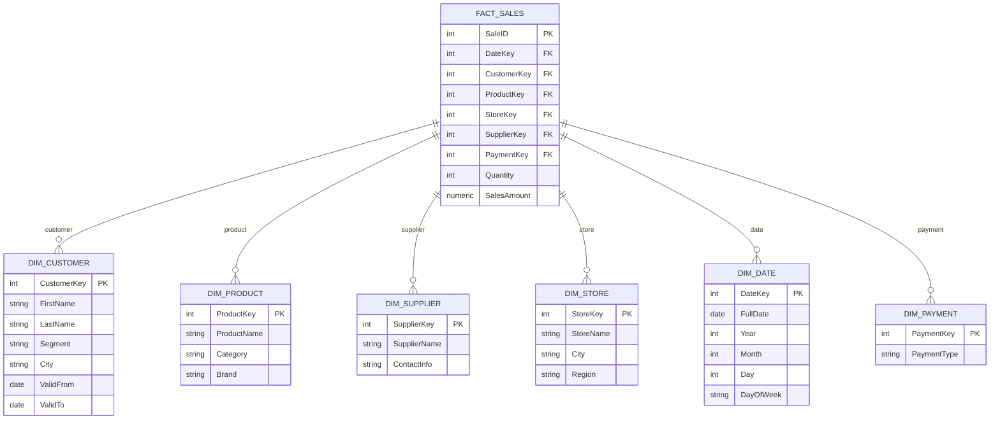

# Practice 3: Dimensional Modeling & Star Schema (Courtesy of  Hasan Tanvir, Kristo Raun, and Ahmed Wael )

Welcome to Practice 3!  
In the last session, we built a normalized **operational database** (OLTP) for supermarket transactions.  
In this session, we’ll shift to building an **analytical database** (OLAP) using **dimensional modeling** and a **star schema**.

---

## Table of Contents (with Time Management)

- [1. Analytical Needs (5 min)](#1-analytical-needs)  
- [2. Why Classical Data Modelling Does Not Work Well for Analytics (10 min)](#2-why-classical-data-modelling-does-not-work-well-for-analytics)  
- [3. Dimensional Modeling Concepts (25 min)](#3-dimensional-modeling-concepts)  
  - [3.1 Identifying the Business Process (5 min)](#31-identifying-the-business-process)  
  - [3.2 Defining the Grain of the Fact Table (5 min)](#32-defining-the-grain-of-the-fact-table)  
  - [3.3 Identifying Dimensions (5 min)](#33-identifying-dimensions)  
  - [3.4 Surrogate Keys & SCD (5 min)](#34-surrogate-keys--scd)  
  - [3.5 DimDate and DimTime (5 min)](#35-dimdate-and-dimtime)  
- [4. Task: Star Schema & OLAP Queries (10 min)](#4-task-star-schema--olap-queries)  
- [5. Environment Setup (5 min)](#5-environment-setup)  
- [6. Implementing in PostgreSQL (20 min)](#6-implementing-in-postgresql)  
- [7. Management Queries (20 min)](#7-management-queries)  
  - [7.1 Daily and Monthly Sales by Store (5 min)](#71-daily-and-monthly-sales-by-store)  
  - [7.2 Sales by Product Category (5 min)](#72-sales-by-product-category)  
  - [7.3 Top-Selling Products and Suppliers (5 min)](#73-top-selling-products-and-suppliers)  
  - [7.4 Average Basket Size (5 min)](#74-average-basket-size-number-of-products-per-purchase)  
- [8. Handling Customer Moves in OLAP (10 min)](#8-handling-customer-moves-in-olap)  

___

## 1. Analytical Needs

Management wants to analyze supermarket sales data.  
The following reporting requirements must be supported:

- **Daily and monthly sales by store**  
- **Sales by product category**  
- **Top-selling products and suppliers**  
- **Average basket size** (number of products per purchase)

---

## 2. Why Classical Data Modelling Does Not Work Well for Analytics

Our OLTP model from Practice 2 is excellent for transactions, but painful for analysis.  
Key reasons:

- **Too many joins**: normalized data spreads information across multiple tables.  
- **Poor performance**: queries involve lots of small tables and foreign keys.  
- **History tracking is difficult**:  
  - Product costs may change over time.  
  - Customers may move to new locations.  
- **Aggregations are scattered**:  
  - Product price is in `Product`.  
  - Quantity is in `PurchaseDetail`.  
  - Computing revenue requires multiple joins instead of being centralized.

---

## 3. Dimensional Modeling Concepts

### 3.1 Identifying the Business Process

- Determine the **core thing being measured/analyzed**, e.g., sales transactions.  
- Each fact table corresponds to a business process (FactSales for supermarket purchases).

### 3.2 Defining the Grain of the Fact Table

- **Grain** defines the **level of detail** in the fact table.
- Example for supermarket:
  - One row per **product per purchase** (fine-grained)
  - One row per **purchase** (coarser grain)
- Choosing the correct grain is essential for accurate aggregation.

### 3.3 Identifying Dimensions

- Descriptive attributes that provide context to facts.
- Example dimensions for supermarket: Customer, Product, Store, Supplier, Payment, Date.

### 3.4 Surrogate Keys & SCD

- **Use surrogate keys** (integer IDs) for dimensions instead of business keys.
- **Slowly Changing Dimensions (SCD)**:
  - **Type 1**: overwrite old value (no history)
  - **Type 2**: keep history with `ValidFrom` and `ValidTo` fields
    - Current record: `ValidFrom = currentdate`, `ValidTo = 9999-12-31`
    - Previous record: `ValidTo = currentdate - 1`
- Example: customer moves to new city, SCD Type 2 keeps historical purchases accurate.

### 3.5 DimDate and DimTime

- Pre-built date dimension (`DimDate`) allows fast aggregation by day, month, quarter, year.
- Optional `DimTime` supports feature engineering for hour/minute analysis.

---

## 4. Task: Star Schema & OLAP Queries

### ER Model (from Practice 2 – OLTP)
Entities included:  
- **Customer**  
- **Product** (with Category, Supplier)  
- **Store**  
- **Purchase** (with PurchaseDetail)  
- **Payment**  

These were normalized for operations.

### Star Schema (for OLAP)



---

## 5. Environment Setup

We will use the same environment setup as in Practice 2.
The compose.yml file remains exactly the same, so no changes are required.

## 6. Implementing in PostgreSQL

We will use a star schema for supermarket analytics. The tables you need to create are:

DimDate – contains dates and calendar attributes (year, month, day, day of week)

DimStore – information about stores (name, city, region)

DimProduct – product details (name, category, brand)

DimSupplier – supplier information (name, contact info)

DimCustomer – customer details with history (name, segment, city, valid from/to dates)

DimPayment – types of payment (cash, card, voucher)

FactSales – the central fact table recording each sale with quantity and amount, linking to all dimensions

Each dimension provides context for the sales in FactSales, making it easy to analyze performance across different perspectives.

<details>
<summary>Solution</summary>

### Example Schema

```sql
CREATE TABLE DimDate (
    DateKey SERIAL PRIMARY KEY,
    FullDate DATE NOT NULL,
    Year INT,
    Month INT,
    Day INT,
    DayOfWeek VARCHAR(10)
);

CREATE TABLE DimStore (
    StoreKey SERIAL PRIMARY KEY,
    StoreName VARCHAR(100),
    City VARCHAR(50),
    Region VARCHAR(50)
);

CREATE TABLE DimProduct (
    ProductKey SERIAL PRIMARY KEY,
    ProductName VARCHAR(100),
    Category VARCHAR(50),
    Brand VARCHAR(50)
);

CREATE TABLE DimSupplier (
    SupplierKey SERIAL PRIMARY KEY,
    SupplierName VARCHAR(100),
    ContactInfo VARCHAR(255)
);

CREATE TABLE DimCustomer (
    CustomerKey INT NOT NULL,         -- stable business key
    FirstName VARCHAR(50),
    LastName VARCHAR(50),
    Segment VARCHAR(50),
    City VARCHAR(50),
    ValidFrom DATE,
    ValidTo DATE
);


CREATE TABLE DimPayment (
    PaymentKey SERIAL PRIMARY KEY,
    PaymentType VARCHAR(20)
);

CREATE TABLE FactSales (
    SaleID SERIAL PRIMARY KEY,
    DateKey INT REFERENCES DimDate(DateKey),
    StoreKey INT REFERENCES DimStore(StoreKey),
    ProductKey INT REFERENCES DimProduct(ProductKey),
    SupplierKey INT REFERENCES DimSupplier(SupplierKey),
    CustomerKey INT,
    PaymentKey INT REFERENCES DimPayment(PaymentKey),
    Quantity INT,
    SalesAmount NUMERIC(10,2)
);
```
</details>
---


## 6. Populate Dummy Data

Before running analytical queries, we need some dummy data in our tables.
This data simulates real supermarket operations and allows you to practice queries on FactSales and the dimensions.

The dummy data includes: dates, stores, products, suppliers, customers, payment types, and sample sales.
Once inserted, you can run the queries for daily sales, top products, average basket size, and more.


<details>
<summary>Solution</summary>

```sql
-- DimDate
INSERT INTO DimDate (FullDate, Year, Month, Day, DayOfWeek)
VALUES 
('2025-09-18', 2025, 9, 18, 'Thursday'),
('2025-09-19', 2025, 9, 19, 'Friday'),
('2025-09-20', 2025, 9, 20, 'Saturday');

-- DimStore
INSERT INTO DimStore (StoreName, City, Region)
VALUES
('SuperMart Downtown', 'Tallinn', 'North'),
('SuperMart Suburb', 'Tartu', 'South');

-- DimProduct
INSERT INTO DimProduct (ProductName, Category, Brand)
VALUES
('Apple', 'Fruit', 'FreshFarm'),
('Banana', 'Fruit', 'Tropicana'),
('Milk', 'Dairy', 'DairyBest'),
('Bread', 'Bakery', 'BakeHouse');

-- DimSupplier
INSERT INTO DimSupplier (SupplierName, ContactInfo)
VALUES
('FreshFarm Supplier', 'fresh@farm.com'),
('Tropicana Supplier', 'contact@tropicana.com'),
('DairyBest Supplier', 'sales@dairybest.com'),
('BakeHouse Supplier', 'info@bakehouse.com');

  
--dimcustomer
INSERT INTO DimCustomer (CustomerKey, FirstName, LastName, Segment, City, ValidFrom, ValidTo)
VALUES
(1, 'Alice', 'Smith', 'Regular', 'Tallinn', '2025-01-01', '9999-12-31'),
(2, 'Bob', 'Jones', 'VIP', 'Tartu', '2025-01-01', '9999-12-31');


-- DimPayment
INSERT INTO DimPayment (PaymentType)
VALUES
('Cash'), ('Card'), ('Voucher');

-- FactSales
INSERT INTO FactSales (DateKey, StoreKey, ProductKey, SupplierKey, CustomerKey, PaymentKey, Quantity, SalesAmount)
VALUES
(1, 1, 1, 1, 1, 2, 5, 5*1.2),
(1, 1, 2, 2, 1, 1, 3, 3*0.8),
(2, 2, 3, 3, 2, 2, 2, 2*2.5),
(2, 2, 4, 4, 2, 2, 1, 1*1.5),
(3, 1, 1, 1, 2, 1, 10, 10*1.2),
(3, 1, 3, 3, 1, 2, 1, 1*2.5);

```
</details>
---

## 7. Management Queries

### 7.1 Daily and Monthly Sales by Store

In this section, we will write queries to analyze sales performance at the store level. The focus is on aggregating sales data by day and by month to identify trends, peak periods, and store-wise performance.


### 7.2 Sales by Product Category


### 7.3 Top-Selling Products and Suppliers


### 7.4 Average Basket Size (Number of Products per Purchase)


## 8. Handling Customer Moves in OLAP

- **Problem in OLTP**: updating customer address overwrites history; past purchases show new city, which is SCD Type 1. 

**SCD Type 1 (Overwrite – No History)**

Old Data

| CustomerKey | FirstName | LastName | Segment | City    |
| ----------- | --------- | -------- | ------- | ------- |
| 1           | Alice     | Smith    | Regular | Tallinn |


New Data 

| CustomerKey | FirstName | LastName | Segment | City    |
| ----------- | --------- | -------- | ------- | ------- |
| 1           | Alice     | Smith    | Regular | Tartu   |

The old city (Tallinn) is lost. Past purchases now appear under the new city.

- **Solution in OLAP (SCD Type 2)**: maintain historical records with `ValidFrom` and `ValidTo`.

Example:

| CustomerKey | FirstName | LastName | Segment | City    | ValidFrom  | ValidTo    |
| ----------- | --------- | -------- | ------- | ------- | ---------- | ---------- |
| 1           | Alice     | Smith    | Regular | Tallinn | 2025-01-01 | 2025-09-20 |
| 3           | Alice     | Smith    | Regular | Tartu   | 2025-09-21 | 9999-12-31 |

Alice's new CustomerKey is 3 because Bob is 2. 


**Explanation:**
- Historical purchases remain linked to the original city.
- New purchases after the move link to the new city.
- This ensures analytics correctly reflects sales by location and customer history.


